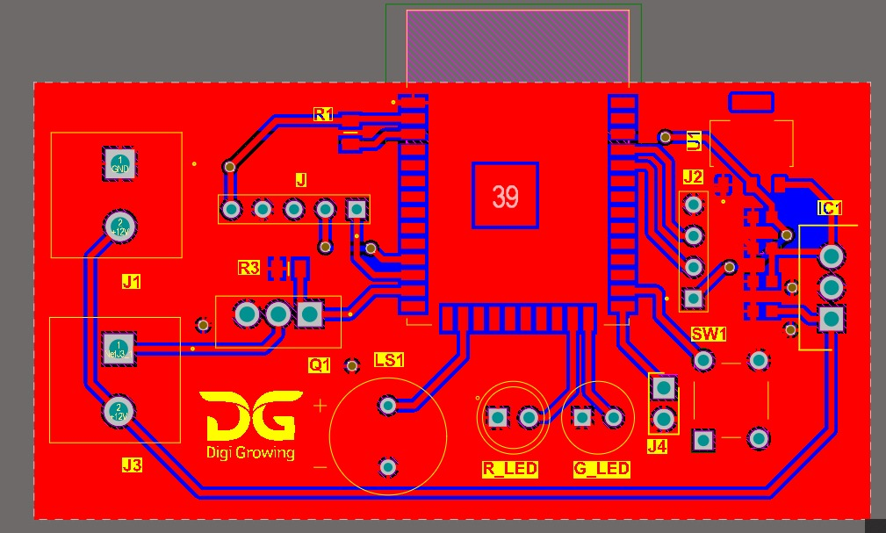

# 🔒 Smart Access Control System

### Overview
Developed a secure RFID-based access control system using ESP32.  
Designed custom PCB with Altium Designer, simulated hardware, and 3D-printed an enclosure for integration.

### Features
- Secure UID storage with SPIFFS on ESP32
- Custom PCB for compact hardware
- Functional prototype validated with RFID tags
- Enclosure prototyped with Creality Ender S3 (3D printing)

### Tech Stack
ESP32, C++, Altium Designer, SPIFFS, 3D Printing

### Media
- 📸 PCB Design: 
- 🎥 [Demo Video (YouTube)](https://youtu.be/xxxx)  
  *(~2min prototype showcase with working firmware)*

### Contributions
- Designed and tested hardware system with RFID
- Implemented secure firmware for UID storage
- Created 3D-printed protective housing

